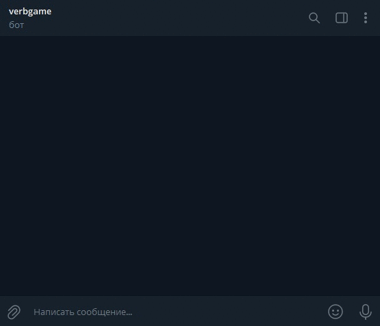

# Учебный проект [devman](dvmn.org) "Распознаём речь"

## Описание
В этом учебном проекте выполняется связывание Телеграм- и ВК-ботов с Google-сервисом распознавания речи.



## Установка
#### Установите [Python3](python.org).

#### Создайте проект в [Google Cloud](https://cloud.google.com/dialogflow/es/docs/quick/setup).
- получите файл ключа: *[Google-консоль](https://console.cloud.google.com/) - IAM & Admin - Service Accounts - Keys - Add key*.

**Внимание! Файл ключа можно скачать только при создании ключа!**

Если по каким-либо причинам вы не сохранили его при создании ключа, то удалите имеющийся ключ и создайте новый. И сохраните уже, наконец, файл!!! )))))

- запомните *Project ID*. Его нужно будет указать в переменных окружения.

Создайте агента в [DialogFlow](http://DialogFlow.com) и подключите его к вашему проекту.
При создании обязательно укажите ваши язык и время.  

В агенте создайте интент - правило, согласно которому сервис будет обрабатывать входящие сообщения.
По сути это набор слов или фраз, объединённых одной темой, которые агент будет пытаться распознать во входящих 
сообщениях, и набор слов или фраз, которыми он будет отвечать.
При создании агента у него уже есть два интента - на начало диалога и его завершение.
Можно добавлять свои интенты и редактировать существующие.

#### Создайте [группу](https://vk.com/groups?tab=admin) в ВК
Создайте ключ доступа: *Настройки* - *Работа с API* - *Ключи доступа* - кнопка **Создать ключ**.

Там же включите **Long Poll API**.

### Установите зависимости
```shell
pip install -r requirements.txt
```

### Задайте переменные окружения
Создайте файл `.env` со следующим содержимым:
```
TG_TOKEN=<ваш Телеграм-токен>
GOOGLE_APPLICATION_CREDENTIALS=<имя файла-ключа для сервиса Google>
GOOGLE_PROJECT_ID=<ID проекта Google>
VK_TOKEN=<токен ВКонтакте>
```

Для создания Телеграм-бота обратитесь к [bot-father](https://t.me/BotFather) и получите у него `TG_TOKEN` вашего нового бота.

`GOOGLE_APPLICATION_CREDENTIALS` - файл ключа из [Google-консоли](https://console.cloud.google.com/)

`GOOGLE_PROJECT_ID` - [Google-консоль](https://console.cloud.google.com/) - *Project Info* - **Project ID**

`VK_TOKEN` - ключ доступа в группе ВК.

## Использование
### Создание интентов
Скрипт позволяет создать один или сразу несколько интентов.

Для этого потребуется `json`-файл следующей структуры:
```
{
    "Название интента": {
        "questions": [
            "Фраза 1",
            "Фраза 2"
        ],
        "answer": [
            "Ответ 1",
            "Ответ 2"
        ]
    },
```

Чтобы создать один интент, в командной строке вызовите скрипт, указав ему имя `json`-файла и название интента, содержащееся в `json`-файле:
```shell
python gflow.py <имя json-файла> -i <название интента из json-файла>
```

Чтобы создать интенты для всех вопросов из `json`-файла, вызовите скрипт, указав **только** имя `json`-файла:
```shell
python gflow.py <имя json-файла>
```

### Запуск Телеграм-бота
```shell
python tg.py
```

### Запуск ВК-бота
```shell
python vk.py
```

### Тестовые боты
Оба бота ([Телеграм](https://t.me/verbgame_bot) и [ВК](https://vk.com/im?media=&sel=-216593240)) сейчас доступны для ознакомления.